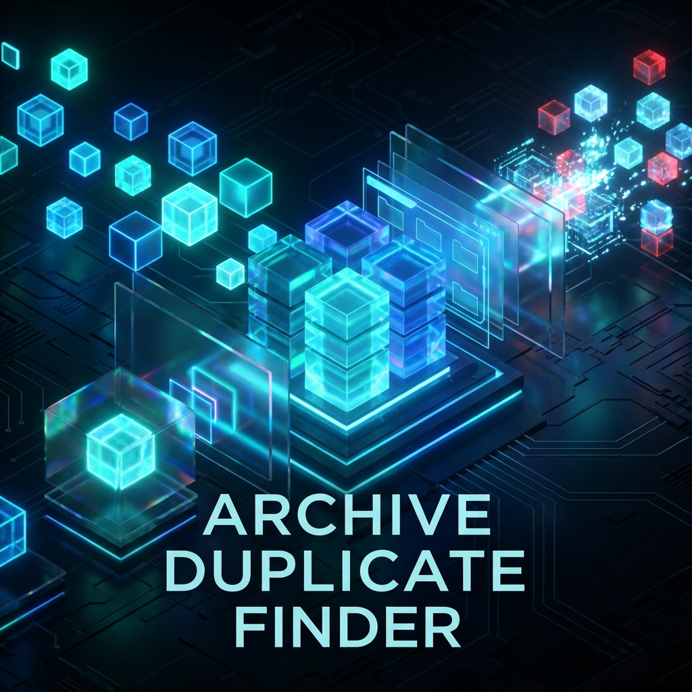

# 📦 Archive Duplicate Finder

<p align="center">
  
</p>

[](https://golang.org/)
[](LICENSE)

**Archive Duplicate Finder** is a powerful CLI tool written in Go designed to identify and manage duplicate or highly similar archive files (ZIP, RAR, 7Z). It specialized in 3D modeling workflows (like STL files) but is robust for any archive-heavy system.

> ✨ **Note:** This project was developed with the expert assistance of **Antigravity**, a powerful agentic AI coding assistant by Google Deepmind.

---

## 🚀 Features

- **⚡ Lightning Fast Caching:** SQLite-backed persistence remembers your duplicates to skip re-scanning.
- **🧠 Intelligent Clustering:** New O(N) algorithm groups similar filenames instantly, handling 100,000+ files in seconds.
- **💼 Fully Portable:** Configuration is now saved alongside the executable (`archive-finder-settings.json`), making it perfect for USB drives.
- **🧙 Setup Wizard:** New intelligent startup flow. If no config exists, a beautiful setup screen guides you.
- **🔔 Live Notifications:** Receive browser alerts when background analysis finishes.
- **🖼️ Archive Intelligence 3.0:** Deep-recursive extraction with **internal browsing**. View ALL images and STL models inside an archive without extracting them. Now supporting **25+ formats** including `.fbx`, `.blend`, `.gltf`, `.glb`, `.3mf`, `.step`, `.iso` and more.
- **🎨 Cinematic Gallery Experience:** 3x3 adaptive layout with a new **Global Viewer** featuring fluid navigation, keyboard controls, and an **Internal File Selector**. Now including **advanced sorting** and **extension filtering**.
- **🔬 Advanced 3D Geometry Studio:** Integrated professional CAD-viewer using Three.js. Features:
  - **Smart Comparison:** Stacks multiple models vertically for structural analysis.
  - **Immersive Mode:** Professional Fullscreen view with "Stage" lighting, contact shadows, and realistic PBR materials.
  - **Auto-Normalization:** Intelligent scaling to compare models of vastly different units (mm vs inches) side-by-side.
  - **Deep Archive Dive:** Extracts and renders `.stl` files directly from ZIP/RAR previews without unzipping.
- **📂 Explorer Integration:** Open files directly with associated apps or reveal them in the system folder from the dashboard.
- **🛡️ Multi-volume Protection:** Automatically protects split archives (part1, part2, .001) from deletion.
- **🗑️ Trash Mode:** Move duplicates to a safe folder instead of permanent deletion.
- **📝 Reference Tracking:** Leave a `.txt` file pointing to the location of the preserved original.
- **✅ Mark as Good:** Permanently ignore specific groups of files from future reports directly from the UI.
- **🔄 Dynamic Rescan:** Start a new scan with different settings without restarting the application.
- **📄 Pro Reporting:** Generates instant PDF reports even while background analysis is running.

---

## 🛠️ Installation

### Prerequisites

**Go Backend:**
- Go 1.21 or higher

**Node.js Frontend:**
- Node.js 16+ (for building the web dashboard)
- npm or yarn

**Optional - Fast Indexing:**
For faster full-system scans, install one of these (auto-detected):

- **Windows:** [Everything](https://www.voidtools.com/) - Ultra-fast file search
- **macOS:** Spotlight (built-in via `mdfind`)
- **Linux:** `locate` package
  ```bash
  # Ubuntu/Debian
  sudo apt-get install locate
  
  # macOS (Homebrew)
  brew install findutils
  
  # Fedora/RHEL
  sudo dnf install findutils
  ```

### Build from Source

```bash
# Clone the repository
git clone https://github.com/marcoscartes/archive-duplicate-finder.git

# Navigate to the project
cd archive-duplicate-finder

# Install Go dependencies and build backend
go build -o archive-finder ./cmd/finder

# Build the dashboard (Requires Node.js)
cd ui
npm install
npm run build
cd ..
```

### Using Pre-built Binaries

Download from [GitHub Releases](https://github.com/marcoscartes/archive-duplicate-finder/releases):
- `archive-finder-windows-amd64.exe` - Windows 64-bit
- `archive-finder-linux-amd64` - Linux 64-bit
- `archive-finder-darwin-amd64` - macOS Intel
- `archive-finder-darwin-arm64` - macOS Apple Silicon

---

## 📖 Usage

### Basic Scan
```bash
./archive-finder -dir "D:/Archives"
```

### Web Dashboard (Recommended)
```bash
# Just run the executable!
./archive-finder
```
*If it's your first run, the **Setup Wizard** will launch automatically in your browser.*

### Legacy CLI Mode
The tool retains full backward compatibility for automation:
```bash
./archive-finder -dir "D:/Archives" -web
```

### Safe Cleanup
```bash
# Move duplicates to a trash folder and leave a reference note
./archive-finder -dir "D:/Archives" -delete oldest -trash "./trash" -ref -yes
```

### Check Similar Names (CLI)
```bash
# Run clustering analysis immediately without dashboard
./archive-finder -dir "D:/Archives" -check-similar
```

---

## 🧪 Modes

| Mode | Description |
| :--- | :--- |
| `all` | Runs both size and name similarity analysis (Default). |
| `size` | Only looks for files with identical sizes. |
| `name` | Only looks for files with similar names. |

---

## ⚡ Full System Scanning

### Fast Indexing (Auto-Detected)

When you use the **Full PC Scan** mode, the application automatically detects and uses native OS indexing:

| Platform | Database | Speed | Status |
|----------|----------|-------|--------|
| Windows | Everything | ⚡⚡⚡ Seconds | Auto-detected if installed |
| macOS | Spotlight (mdfind) | ⚡⚡ Seconds | Built-in, requires indexing enabled |
| Linux | locate | ⚡⚡ Seconds | Requires `updatedb` to be current |
| Any | Directory Scan | ⏱️ Minutes | Fallback if database unavailable |

**Enable Full PC Scan:**
- **Web UI:** Toggle "Full PC Scan" checkbox in setup
- **CLI:** `./archive-finder --full-system`

The tool will log which indexing method was used:
```
⚡ Everything database detected - using fast indexed search...
✅ Found 1,234 files using Everything
```

---

## 🤝 Acknowledgement

This software was built and refined with the assistance of **Antigravity**, an AI agent specialized in advanced coding tasks. Antigravity helped implement:
- **Optimization V3:** Replaced O(N²) pairwise comparison with O(N) Canonical Clustering for massive datasets.
- **Dynamic Dashboard:** React/Next.js dashboard with real-time progress bars and on-demand analysis triggers.
- Parallel string similarity processing with Bit-Parallel Myers Algorithm.
- Glassmorphic Web Dashboard with Next.js/Three.js.
- Real-time archive preview (On-Hover extraction).
- Multi-platform Explorer/Reveal integration.
- **Cinematic Viewer:** Implemented a global modal system with ergonomic navigation, backdrop-blur effects, and keyboard support.
- **Robust Extractor:** Refactored extraction logic to handle nested subfolders, system folders (MACOSX) filtering, and intelligent STL fallbacks.
- **UI Consistency:** Unified centered 1000px layout and intelligent thumbnails throughout the dashboard.
- PDF reporting modules.
- Multi-volume archive detection logic.
- **Full System Scanning:** Cross-platform implementation with Everything (Windows), Spotlight/mdfind (macOS), and locate (Linux).

---

## 📜 License

This project is licensed under the MIT License - see the LICENSE file for details.
